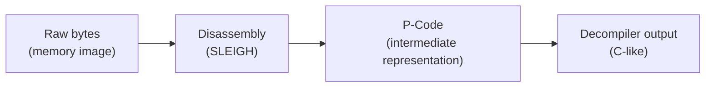

# 01 — Core Workflows

General-purpose Ghidra skills for everyday analysis work, independent of any
particular target platform. These guides assume the 00-quickstart module —
they build on it rather than repeating it (e.g. basic xrefs, the Listing, the
Decompiler window).

SLEIGH — Ghidra's processor-specification language — disassembles the raw
bytes into machine instructions and, from the same specification, produces
the raw P-Code the Decompiler and other analyzers consume; the Decompiler
then transforms that P-Code into the synthesized C-like rendering shown in
the Decompiler window.

1. [Data types & structures](01-data-types-structures.md)
2. [Decompiler tuning: calling conventions & function signatures](02-decompiler-tuning.md)
3. [Control-flow & reference analysis](03-control-flow-reference-analysis.md)
4. [Function ID (FID)](04-function-id-fid.md)
5. [Version Tracking basics](05-version-tracking.md)
6. [Scripting — a preview](06-scripting-outlook.md)

Facts in these guides are checked against the Ghidra 12.1.2 documentation and
source. Ghidra's UI has stayed stable across versions in the areas covered
here, but if something on your screen doesn't match, trust your installed
version — and check `Help → Contents` for the copy that ships with it.
