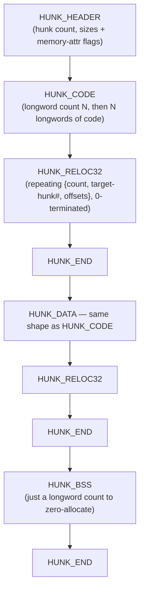

# Amiga Hunk Executable Format

AmigaOS executables aren't ELF or PE — they're **Hunk** files, a sequence of
typed blocks ("hunks") each holding one memory region's worth of code, data,
or BSS, plus relocation and symbol information. Understanding the block
sequence matters because Ghidra doesn't import this format on its own.

## Block types

From the actual AmigaOS NDK header `dos/doshunks.h`:

| Constant | ID | Meaning |
|---|---|---|
| `HUNK_UNIT` | 999 | Start of a compilation unit (linker-object files only) |
| `HUNK_NAME` | 1000 | Name of the following hunk |
| `HUNK_CODE` | 1001 | Executable code |
| `HUNK_DATA` | 1002 | Initialized data |
| `HUNK_BSS` | 1003 | Zeroed, uninitialized data (size only, no content) |
| `HUNK_RELOC32` | 1004 | 32-bit relocations against this hunk |
| `HUNK_RELOC16` / `HUNK_RELOC8` | 1005 / 1006 | 16-/8-bit relocations |
| `HUNK_EXT` | 1007 | External/global symbol definitions and references |
| `HUNK_SYMBOL` | 1008 | Debug symbol names + offsets |
| `HUNK_DEBUG` | 1009 | Arbitrary debug data |
| `HUNK_END` | 1010 | Marks the end of the current hunk |
| `HUNK_HEADER` | 1011 | Load-file header — always first in an executable |
| `HUNK_OVERLAY` / `HUNK_BREAK` | 1013 / 1014 | Overlay support (rare in practice) |
| `HUNK_LIB` / `HUNK_INDEX` | 1018 / 1019 | Library/index data (linker-object files) |

(No `1012` — a genuine gap in the numbering, not a transcription error.) Only
the low 29 bits of a hunk ID are the actual type: in `HUNK_HEADER`, the top
bits of each hunk's size longword double as `AllocMem()` memory-attribute
flags (bit 31 = must be Fast RAM, bit 30 = must be Chip RAM). Source:
`dos/doshunks.h` (AmigaOS NDK, Release 2.04 Includes V37.4);
`amiga-dev.wikidot.com/file-format:hunk` (cross-checked against the header's
numeric IDs).

## Layout of a load file

A minimal single-hunk executable looks like:

Real executables commonly have one hunk each for code, data, and BSS (as
above), but the format allows any number of hunks in any order — the header
lists how many and their sizes up front. Each `HUNK_RELOC32` block adds the
target hunk's eventual load address to whatever longword is already stored at
each listed offset within the *current* hunk — this is what lets hunks be
loaded at different (non-fixed) addresses each run. `HUNK_SYMBOL` (not shown
above — optional, debug-only) is a simple repeating `{name, offset}` list,
zero-name-terminated. Source: `amiga-dev.wikidot.com/file-format:hunk`,
cross-checked block-by-block against `doshunks.h`'s IDs.

## Ghidra has no native loader for this

Checked directly against the Ghidra 12.1.2 source tree, two ways: the
`Loader` implementations under
`Ghidra/Features/Base/src/main/java/ghidra/app/util/opinion/` (`ElfLoader`,
`PeLoader`, `MachoLoader`, `CoffLoader`, `MzLoader`, `NeLoader`,
`UnixAoutLoader`, `IntelHexLoader`, `BinaryLoader`, and others — no
Hunk-related class among them), and a full case-insensitive search of the
entire repo tree for `hunk`/`amiga` (zero real hits — the only near-matches
are unrelated `Thunk*` substrings). Consistent with this, `68000.opinion`
only pairs the 68000 language with the ELF/PEF/Palm-Pilot/a.out loaders, not
Hunk.

**Practical consequence**: importing a Hunk executable as-is via `File →
Import File` and letting Ghidra guess the format won't work. The best-known
option is the community extension
[`BartmanAbyss/ghidra-amiga`](https://github.com/BartmanAbyss/ghidra-amiga)
(built on an earlier `lab313ru/ghidra_amiga_ldr`), which loads Hunk
executables, Kickstart ROMs, and WinUAE state files, and ships NDK 3.9
symbols. Its internals (exact loader class, whether relocations are resolved
at import time, one memory block per hunk or not) aren't verified here — this
guide flags the extension as the practical path, not as a fully-audited
recommendation; worth a closer look once an exercise actually needs to import
a real Hunk binary. Without it, the fallback is manually mapping each
hunk's raw bytes as a separate memory block at a chosen address using
`File → Import File → Raw Binary`, and applying relocations by hand — doable,
but exactly the tedious work a proper loader exists to avoid.

---

**Self-check:** a load file has a `HUNK_BSS` immediately followed by
`HUNK_END` with no `HUNK_RELOC32` in between — is that a truncated/corrupt
file? → No: BSS is zeroed, uninitialized memory with nothing to relocate
against, so a bare size-and-`HUNK_END` is the normal, complete shape for that
hunk.
