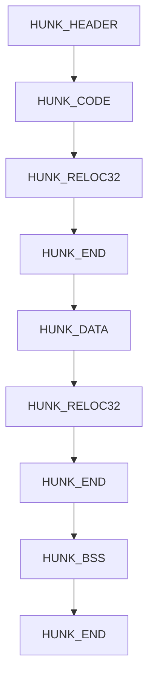

# 02 — Retro: Amiga

First retro-platform module: 68000/AmigaOS-specific recognition skills on top
of the platform-independent workflows from `01-core-workflows`. Priority
order per the curriculum plan is Amiga → Atari ST → C64 — this module covers
Amiga.

A minimal Hunk executable's block sequence — see [Hunk executable
format](02-hunk-executable-format.md) for what each block contains and why
Ghidra needs a third-party extension to load one.

1. [68000 recap](01-68000-recap.md)
2. [Amiga Hunk executable format](02-hunk-executable-format.md)
3. [exec.library & Kickstart basics](03-exec-library-kickstart.md)
4. [Custom chip registers (Agnus/Denise/Paula)](04-custom-chip-registers.md)
5. [Typical copy-protection patterns](05-copy-protection-patterns.md)

Facts in these guides are checked against the Motorola/NXP M68000 Programmer's
Reference Manual, the Amiga Hardware Reference Manual, the Amiga ROM Kernel
Reference Manual, the literal AmigaOS NDK `doshunks.h` header, and Ghidra
12.1.2's own source — see `RESEARCH-NOTES.md` for full sourcing and an
"Unresolved" list of anything that couldn't be pinned to a primary source.
