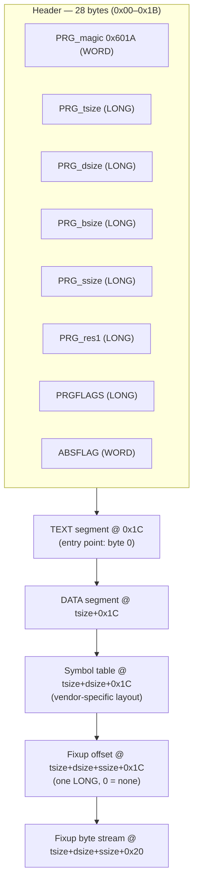

# 03 — Retro: Atari ST

Second retro-platform module, same 68000 CPU as `02-retro-amiga` but a
different OS (TOS/GEMDOS instead of AmigaOS). This module builds directly
on the Amiga module rather than repeating shared ground — the 68000 recap
(`02-retro-amiga/01-68000-recap.md`) isn't restated here, only what's
different for TOS.

Field-by-field detail, the `PRGFLAGS` bit table, and the fixup-stream
encoding are in [PRG/TOS executable format](03-prg-tos-executable-format.md).

1. [68000/TOS differences from Amiga](01-amiga-atari-differences.md)
2. [GEMDOS/BIOS/XBIOS call recognition](02-gemdos-bios-xbios-calls.md)
3. [PRG/TOS executable format](03-prg-tos-executable-format.md)

Printable one-page reference: [cheatsheet-print.md](cheatsheet-print.md).

Facts in these guides are checked against The Atari Compendium, FreeMiNT's
`tos.hyp` documentation, and Ghidra 12.1.2's own source — see
`RESEARCH-NOTES.md` for full sourcing, the Compendium's distribution
caveat, and an "Unresolved" list of anything that couldn't be pinned to a
primary source.
