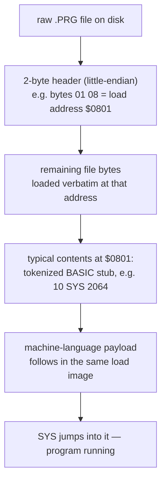

# 04 — Retro: C64

Third and final retro-platform module, and the first change of CPU family
in this course — 6502/6510 instead of the 68000 used throughout
`02-retro-amiga` and `03-retro-atari-st`. The [6502/6510
recap](01-6502-6510-recap.md) covers what's genuinely new; nothing about
general reverse-engineering workflow changes (those are still
`01-core-workflows`'s territory).

A `.PRG` file is just a load address plus raw bytes — no block sequence
like the Amiga's Hunk format, no relocation-fixup stream like the Atari
ST's PRG/TOS header. See [PRG & cartridge
formats](04-prg-cartridge-formats.md) for the full field tables (including
the separate `.CRT` cartridge container format) and why Ghidra needs a
manual Raw Binary import — no native or well-maintained community loader
covers either format.

1. [6502/6510 recap](01-6502-6510-recap.md)
2. [Memory map & bank switching](02-memory-map-bank-switching.md)
3. [KERNAL/BASIC-ROM references in disassembly](03-kernal-basic-rom-references.md)
4. [PRG & cartridge (CRT) formats](04-prg-cartridge-formats.md)
5. [VIC-II & SID registers](05-vic-sid-registers.md)

Facts in these guides are checked against Ghidra 12.1.2's own source
(processor definitions, loader classes), c64-wiki.com's primary reference
tables, the VICE Emulator Manual's documented file-format chapter, and
`sta.c64.org`'s standard KERNAL function reference — see
`RESEARCH-NOTES.md` for full sourcing.
