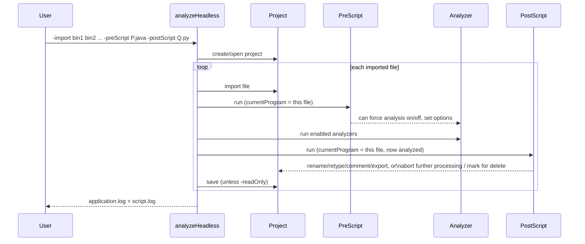

# 05 — Automation & Scripting

Everything in `00-quickstart` and `01-core-workflows` was done by hand, one
cursor position at a time. This module automates it: the same renames,
retypes, and reference-following, driven by a script instead of a mouse —
across one function, every function in a program, or every program in a
batch, including with no GUI open at all.

Three guides, roughly in the order you'd actually reach for them:

1. [Script Manager & the Java API](01-script-manager-java-api.md) — write
   and run a `GhidraScript` from inside the tool, no build step.
2. [Python scripting: Jython vs. PyGhidra](02-python-scripting-jython-pyghidra.md)
   — the same scripting surface in Python; which one is the actual default
   today (it changed since `01-core-workflows/06`'s preview was written).
3. [The Headless Analyzer](03-headless-analyzer.md) — running import,
   analysis, and scripts with no GUI at all, for batch processing.

Pre-scripts run *before* analysis (useful for setting options analysis
should honor, or deciding whether to skip analysis for this file);
post-scripts run *after* (useful for anything that reads analysis results —
which is most scripting work). Both are optional, both can repeat, and a
script gets no say in whether it's a pre- or post-script — that's decided
entirely by which flag names it on the command line.

Facts in these guides are checked against the Ghidra 12.1.2 documentation
that ships in the distribution itself, and — new for this module — against
an actual installed copy on this machine: several claims below were run,
not just read. See `RESEARCH-NOTES.md` for exactly which.

**One correction worth flagging up front**: this module's original plan
described "Jython scripting" and "Ghidrathon (Python 3) as the modern
path." Neither half of that is quite true anymore in 12.1.2 — Jython is now
an opt-in extension, not built in, and Ghidrathon-the-community-project has
effectively been superseded by **PyGhidra**, which Ghidra now ships and
integrates natively. Guide 2 covers what actually shipped.
